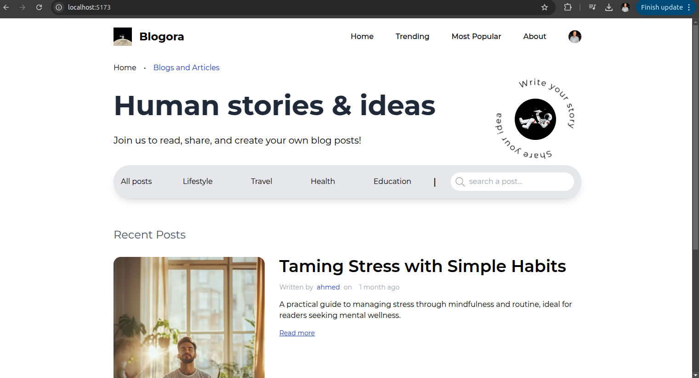
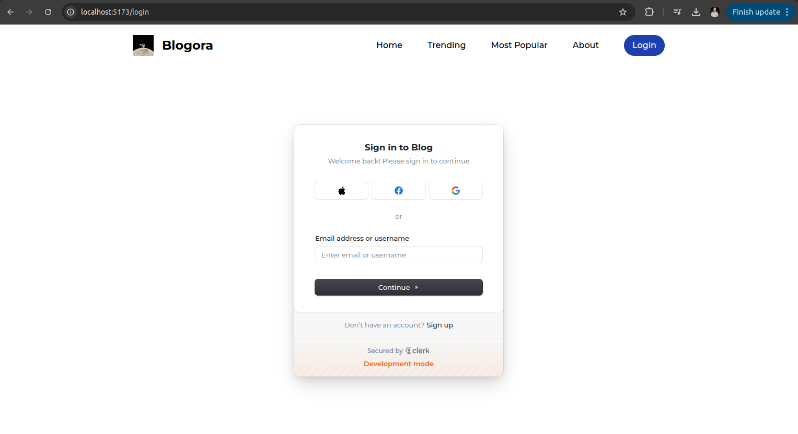
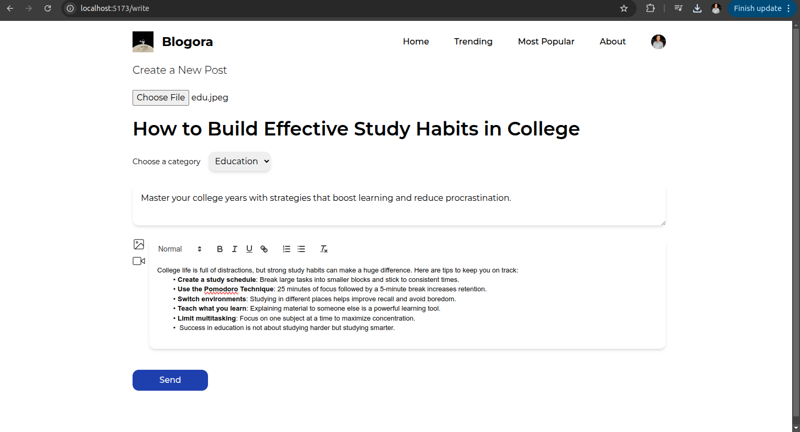
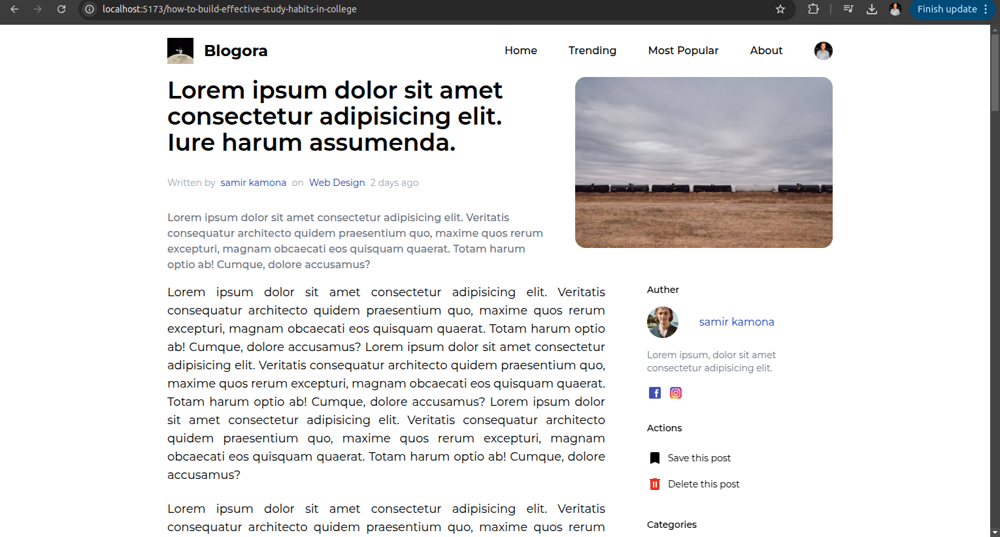
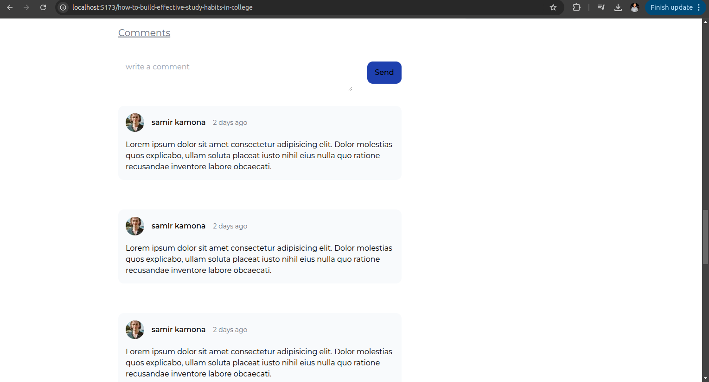

# Full-Stack Blog Website

A responsive and modern full-stack blog platform built using React, Express.js, Node.js, and MongoDB.

---

## Features

- Frontend built with React and React Router
- Authentication handled using Clerk
- RESTful APIs for blog CRUD operations
- MongoDB for database storage
- Express.js backend with Node.js
- Fully responsive design

---

## Screenshots

### Homepage

### Authentication (Login / Register)

### Create Blog

### View Single Blog

### Comment Section

All screenshots are stored in the `assets/` folder of this repository.

---

## Tech Stack

| Technology   | Description                  |
|--------------|------------------------------|
| React        | Frontend framework           |
| Express.js   | Backend framework            |
| Node.js      | JavaScript runtime           |
| MongoDB      | NoSQL database               |
| Clerk        | Authentication and user management |
| REST API     | For blog operations (CRUD)   |

---

## Demo
Demo: https://drive.google.com/file/d/1GSXVGlMbeJDVZANC_UT8nbGdNUx_natu/view?usp=drive_link
